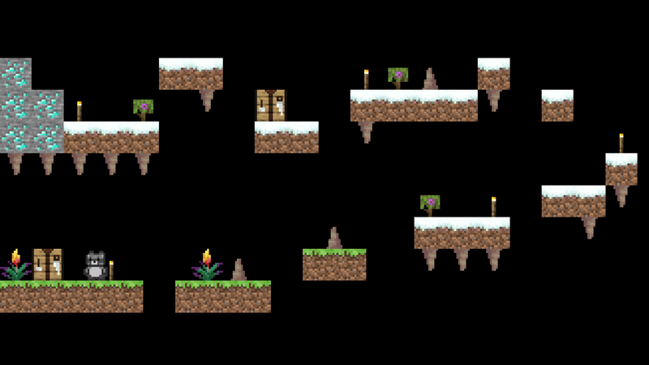

# In THe Sky

A simple 2D platformer game made in **GameMaker** using custom logic for movement, gravity and collisions.
The game uses 16x16 pixel assets inspired by Minecraft textures.

## Movement System

The player uses:

- Left Arrow → Move left
- Right Arrow → Move right
- Up Arrow → Jump

The movement is handled using:

- x_speed
- y_speed
- Gravity acceleration
- Ground detection using place_meeting

The level restarts if:

- The player touches spikes
- The player touches certain hazard objects
- The player leaves the room bounds

## How to run:

1. Build:
- Open the project in GameMaker
- Select target (Windows or HTML5)
- Click Run or Build

2. ZIP
- Download the zip file `In the Sky.zip`
- run the executable

### OR

Open the attached [itch.io link](https://valymnd-bot.itch.io/in-the-sky)!

And u are all set!

### Made for "Campfire" event hosted by HackClub

